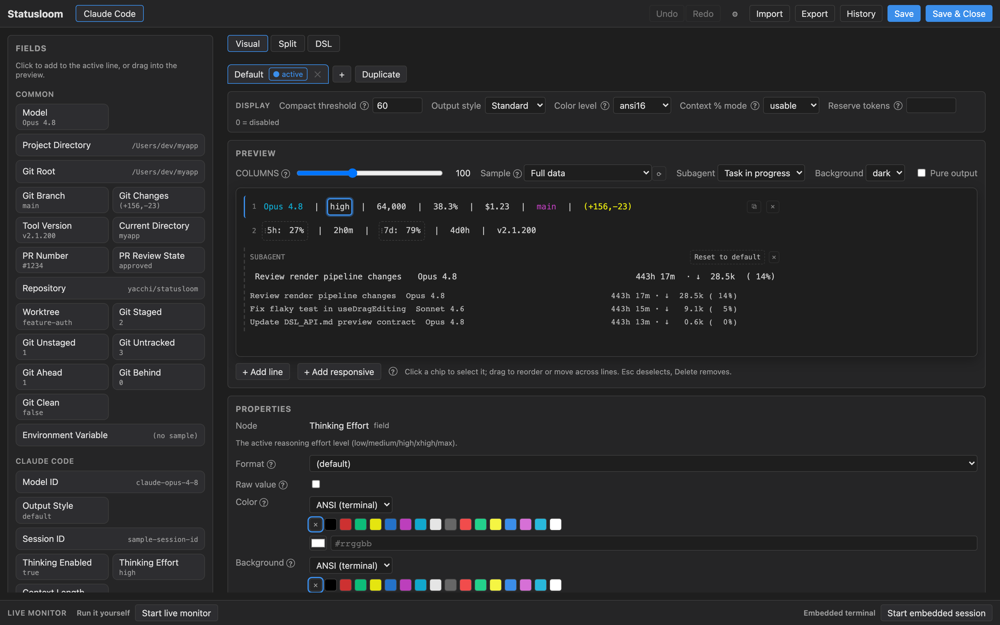
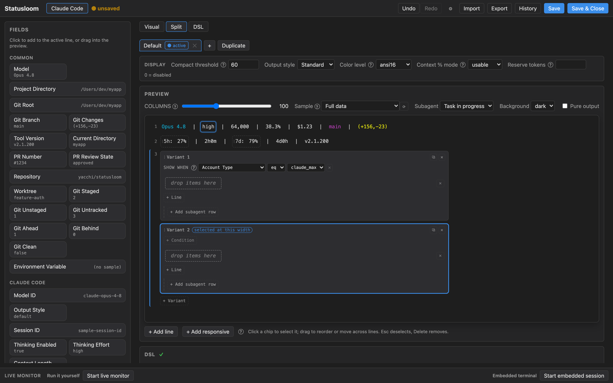
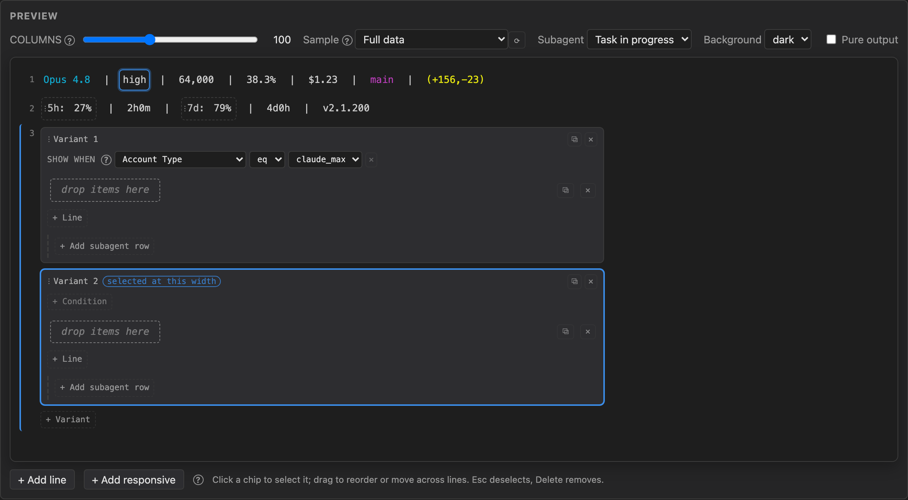
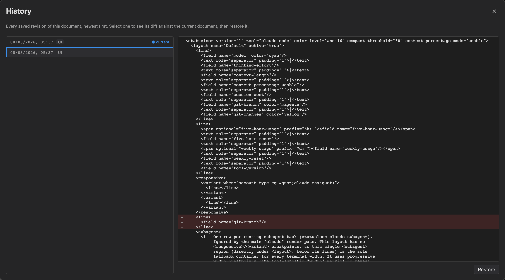
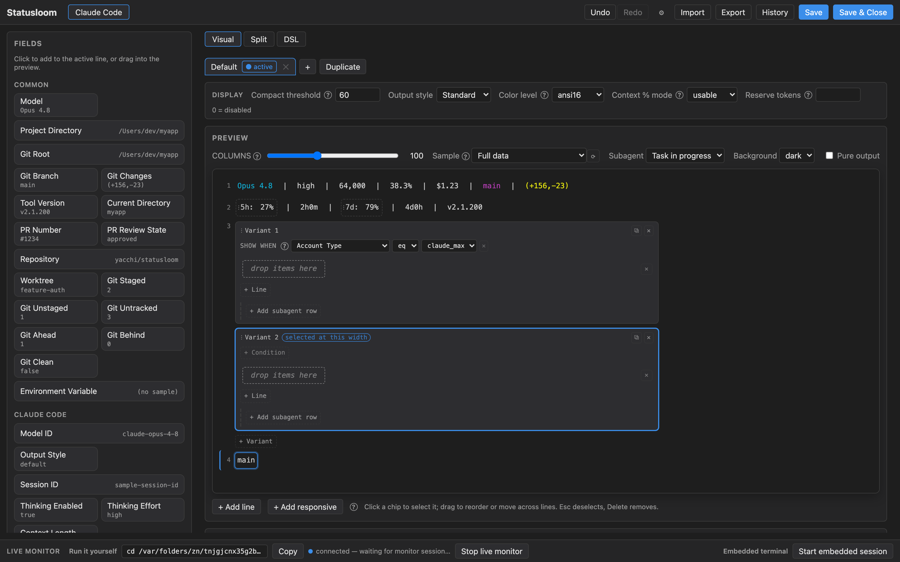
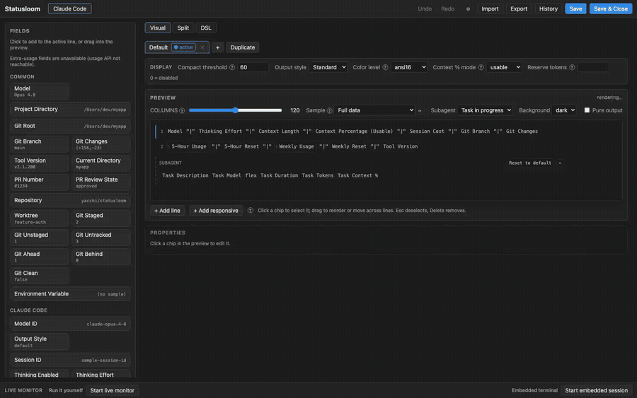

# Statusloom

Statusloom is a fast, portable status-line toolkit for coding agents. Build, preview, install, and share status lines for Claude Code, Codex, GitHub Copilot, and other coding tools. Statusloom ships as a single Go binary, keeps the render path network-free, and includes a visual local configurator.

*日本語版: [README.ja.md](README.ja.md)*



The preview *is* the editor: click a field in it to edit that field, drag
to rearrange, and watch the real rendered output change as you go.


## Status

Statusloom is in early development. v0.1 targets Claude Code.

**Requirements**: Claude Code v2.1.132+ (for correct `context_window`
token semantics). Flex-separator width resolution and
`compactThreshold` additionally require v2.1.153+ — Claude Code only
started passing `COLUMNS`/`LINES` to the status line command in that
release. On v2.1.132–v2.1.152, flex-separators fall back to a single
space and compact mode never triggers.

## Installation

### Homebrew (macOS / Linux, recommended)

```sh
brew install yacchi/tap/statusloom
```

Windows users should use the GitHub Releases archives below.

### GitHub Releases (manual)

Prebuilt archives are published for macOS, Linux, and Windows (amd64 and
arm64). Download the archive for your platform from the
[Releases page](https://github.com/yacchi/statusloom/releases), extract
it, and place the `statusloom` binary somewhere on your `PATH`.

### From source (developers)

Building from a clone embeds the web configurator UI (unlike
`go install ...@latest`, which would only ship the placeholder page).
The toolchain is pinned in `mise.toml` (Go, Node, pnpm), so install
[mise](https://mise.jdx.dev/) first, then run a single command:

```sh
git clone https://github.com/yacchi/statusloom.git
cd statusloom
mise run install   # installs Go/Node/pnpm, builds the UI, and installs statusloom
```

`mise run install` auto-installs the pinned toolchain, builds and embeds
the configurator UI, then runs `go install ./cmd/statusloom`. Because it
builds from the local working tree, the freshly built UI in
`internal/webconfig/dist` is embedded into the binary. (This is why
cloning works but `go install ...@latest` does not: the embedded assets
are git-ignored and never committed — see `CLAUDE.md`.) This
works on Windows too, though running Claude Code itself on Windows is not
yet well supported.

To run directly from the checkout without installing, `mise run build`
produces `./statusloom` in the repo root, and `mise run config` launches
the configurator.

### After installing

Register statusloom as Claude Code's status line command:

```sh
statusloom setup claude-code
```

This writes `statusLine.command` into `~/.claude/settings.json` for
you (see [Usage](#usage) below for the equivalent manual JSON). If you
use profiles via `CLAUDE_CONFIG_DIR`, statusloom follows it and writes
`$CLAUDE_CONFIG_DIR/settings.json` instead; `--settings <path>` always
overrides both.

## Usage

### Claude Code status line

Add statusloom as Claude Code's status line command in `settings.json`:

```json
{
  "statusLine": {
    "type": "command",
    "command": "statusloom claude"
  }
}
```

Claude Code invokes this command on every prompt, piping session JSON to
its stdin; `statusloom claude` renders the configured status line to
stdout.

### Subagent status line

Claude Code's `subagentStatusLine` setting renders one line per running
subagent in the agent panel. Statusloom implements it with a separate
command:

```json
{
  "subagentStatusLine": {
    "type": "command",
    "command": "statusloom claude-subagent"
  }
}
```

Claude Code pipes a JSON array of subagent tasks to stdin; `statusloom
claude-subagent` writes one `{"id", "content"}` JSON line per task to
stdout. Subagent rows are configured as a `<subagent>` element inside the
SAME `claude-code` document (not a separate document — see
[Configuration](#configuration)), scoped to its own field catalog — `task-description`,
`task-model`, `task-model-id`, `task-tokens`, `task-context-size`,
`task-context-percent`, `task-status`, and `task-duration` (see
[Fields](#fields)). Pass `--draft` to render the shared draft document
instead of the saved one, mirroring `statusloom claude`'s `--draft`
handling; monitor workspaces use this to preview unsaved subagent-row
edits. Pass `--preview` to render a built-in representative payload
(a few sample tasks) instead of reading stdin, so you can see the row
without hand-crafting a `tasks[]` JSON; it composes with `--draft`.

**Protocol limitation:** the `subagentStatusLine` stdin payload carries
no per-subagent reasoning effort or agent type name (e.g.
`general-purpose`), so statusloom's rows can't reproduce the agent type
label Claude Code's own default row leads with — only model, tokens,
context, duration, and status are available. A `task-effort` field
exists in the catalog for forward compatibility but is currently always
unavailable.

### Configurator

```
statusloom config [--port N] [--no-browser]
```

Starts a local web UI (bound to `127.0.0.1` only) for viewing, editing,
and previewing your statusloom configuration. It offers two editing
modes over the same document: a **Visual Editor** (drag fields from a
palette, edit them directly on a live preview) and a **DSL Editor** (edit
the XML markup as text with live diagnostics and preview). By default it
picks a random free port and opens your browser to it; pass `--port` to
bind a specific port, and `--no-browser` to skip opening a browser
automatically. The server prints its URL (including a one-time auth
token) to stdout and shuts down on `Ctrl-C`, after an idle period, or
when you close it from the UI.

Subagent rows are edited inside the same document: each width-adaptive
container gets a Subagent region in the editor, filled from the task-scoped
field catalog. Its preview can toggle between a running and a completed
sample task.

Both editors work on one document, so you can build a layout visually and
read the markup it produced — or the other way round:



A `<responsive>` container holds several candidate layouts; the editor
marks the one the current width selects, and a variant can additionally
carry a condition (for example, only on a Team account):



#### Version history

Every save is a revision. The History panel lists them newest first, shows
the diff of any revision against the current document, and restores it —
so trying a layout out costs nothing.



#### Live preview against your own sessions

The samples above are synthetic. The live monitor renders your status line
from REAL session snapshots as they arrive, so you can see how a layout
behaves on your actual repositories, usage, and costs rather than on made-up
numbers. It prints a command to run in whichever terminal you want to
watch:



#### Customizing with Claude Code itself

"Start embedded session" opens a terminal inside the configurator running
Claude Code in a workspace statusloom provisions for it: its own
`CLAUDE.md` explaining the DSL and the current document, a sample stdin
payload, and a status line wired to `--draft`. So you can ask the agent for
what you want in words ("put the git branch on the right, and drop the cost
when the terminal is narrow"), and its edits land in the shared draft that
the visual editor and the preview are already showing. Describing a status
line is often faster than assembling one, and you keep both routes over the
same document.

### Setup

```
statusloom setup claude-code
statusloom setup claude-code --refresh-interval 60
```

Configures Claude Code to run `statusloom claude` (`statusLine`) and
`statusloom claude-subagent` (`subagentStatusLine`). Existing settings
are backed up, and replacing a different status-line command requires
confirmation.

`--refresh-interval <seconds>` sets Claude Code's own `refreshInterval`
setting (minimum 1 second), applied to both `statusLine` and
`subagentStatusLine`. Claude Code doesn't emit new statusline events
while idle, so countdown widgets like `five-hour-reset` and
`weekly-reset` otherwise freeze until the next event; use this flag if
you configure those widgets. `statusloom doctor` warns when
`refreshInterval` is unset while a countdown widget is configured.

### Format

```
statusloom fmt [file] [--check]
```

Rewrites a DSL document in canonical form — normalizing attribute order,
self-closing tags, indentation, and every `when` expression to the word
form (`and`, `or`, `lt`, `ge`, ...). With no argument it formats the saved
`claude-code` document; `-` reads stdin and writes stdout; `--check` reports
whether formatting would change the document (non-zero exit) without
writing. Normal saves through the configurator preserve your original
formatting for untouched nodes; `fmt` is the opt-in whole-document
canonicalizer.

### Diagnostics

Run `statusloom doctor` to check the binary, the status-line document,
the cache, Git, and Claude Code setup — including whether
`refreshInterval` is configured when countdown fields (`five-hour-reset`,
`weekly-reset`) are in use.

### Editing the draft from your editor or an agent

```
statusloom draft pull [file]     # write the configurator's unsaved draft to a file
statusloom draft push [file]     # push an edited file back as the draft
```

The configurator's unsaved edits live in a shared draft, and these two
commands are the file-shaped end of it. Pull it, edit it in your own editor
(or hand it to a coding agent), push it back, and the open configurator
picks the change up — preview included — without anyone having to save
first. This is what the embedded terminal's workspace uses, and it needs no
token, since it goes through the local store rather than the HTTP API.

`statusloom claude --draft` renders the draft instead of the saved document,
so you can also point a real Claude Code session at work in progress.

### Version history from the CLI

```
statusloom history list
statusloom history show <id>
statusloom history diff <id> [<id2>]
statusloom history restore <id> [--force]
```

The same revisions the History panel shows. `restore` refuses to discard an
unsaved draft that differs from the current document unless you pass
`--force`.

### Sharing a document: the Markdown exchange format

```
statusloom export [-o file]      # a *.sloom.md document (stdout by default)
statusloom import <file>         # import one as a new revision ("-" reads stdin)
```

A `*.sloom.md` is frontmatter plus a fenced `xml` block — readable as a
document in its own right, and importable verbatim. It is how presets travel
between machines and people:

```sh
statusloom export -o my-layout.sloom.md
# … on another machine
statusloom import my-layout.sloom.md
```

Import goes through exactly the same Parse+Validate boundary as saving from
the configurator, so a document that imports is a document that renders.

### Live preview and rendering

```
statusloom monitor --emit-url URL --token TOK
statusloom render [--tool ID]
statusloom version
```

`monitor` renders like `statusloom claude` and additionally forwards the
payload to a running configurator, which is what drives the live monitor
described above — the configurator prints the exact command to paste.
`render` is the tool-agnostic entry point: it detects the tool from the
stdin payload when `--tool` is omitted.

## Fields

Statusloom ships a catalog of built-in fields for Claude Code covering
model, context usage, cost, Git status, and rate limits. A `<field>`
hides itself automatically when its underlying data isn't available.

Recently added:

- `session-name` — session name set via `--name` or `/rename`
- `agent-name` — name of the running agent, when started with `--agent`
- `vim-mode` — current vim mode, when vim mode is enabled. If you use
  this widget, set `hideVimModeIndicator: true` in Claude Code's
  settings to avoid showing the mode twice
- `pr-number` — open PR for the current branch (e.g. `#1234`); hidden
  once the PR is merged or closed
- `pr-review-state` — `approved` / `pending` / `changes_requested` / `draft`
- `repo-name` — `owner/name` derived from the `origin` remote
- `worktree` — name of the current linked Git worktree
- `session-duration` / `api-duration` — elapsed wall-clock time / API
  time, formatted like `1h 15m`
- `lines-changed` — lines added/removed in the session, formatted like
  `(+156,-23)`
- `cache-hit-rate` — prompt cache hit rate over recent API calls
- session/model state: `session-id`, `model-id`, `output-style`,
  `thinking-enabled`
- context detail: `context-window-size`, `context-remaining`,
  `context-output-tokens`, `current-input-tokens`, `current-output-tokens`,
  `cache-creation-tokens`, `cache-read-tokens`, `exceeds-200k`
- repository detail: `project-directory`, `git-root`, `git-staged`,
  `git-unstaged`, `git-untracked`, `git-ahead`, `git-behind`, `git-clean`
- `lines-added` / `lines-removed` — separate session line counts

The `<subagent>` region (see [Subagent status
line](#subagent-status-line)) only accepts fields scoped to a single
subagent task: `task-description`, `task-model`, `task-model-id`,
`task-tokens`, `task-context-size`, `task-context-percent`,
`task-status`, and `task-duration`. `task-effort` is also registered
but currently always unavailable, since Claude Code's
`subagentStatusLine` protocol doesn't expose per-subagent reasoning
effort.

### Grouping with `<span>`

A `<span>` wraps several children and treats them as one thing. That single
idea covers most of what a status line needs beyond "print this value":

```xml
<span prefix="5h: " suffix=" left" padding="1"
      color="cyan" optional="five-hour-usage">
    <field name="five-hour-usage" format="percent"/>
    <text> / </text>
    <field name="five-hour-reset" format="countdown"/>
</span>
```

- **One style for the group.** `color`, `background`, `bold`, `dim`,
  `italic`, `underline`, and `strikethrough` are inherited by everything
  inside (nearest wins), so you colour a group once instead of every field
  in it.
- **Labels that belong to the group.** `prefix`, `suffix`, and `padding`
  render in the group's own style and are not inherited by children.
- **One visibility decision for the group.** `optional="<field>"` and
  `when="..."` gate the whole span — the label disappears together with the
  data, which is the reason `5h: ` is written as a span's prefix rather than
  as a separate `<text>`. Without grouping you would have to repeat the same
  condition on the label and on every field.
- **Nesting.** Spans nest, so a group can carry a shared colour while an
  inner group flips one part of it.

The editor mirrors this: a span renders as a bordered chip group you can
drag chips into and out of, and selecting the group (its `⋮` grip) edits the
group's own style, condition, and label. Below: selecting the group, giving
the whole group a colour at once, editing the group's label, then overriding
one child — the group's colour stays on everything else.



### Adaptive width: separators, flex, compact, and variants

Four mechanisms, from smallest to largest, keep a line readable as the
terminal narrows:

- **Collapsing separators.** `<text role="separator">` is dropped when it
  would end up leading, trailing, or next to another separator — so hiding a
  field never leaves a dangling ` | `. You write separators between every
  field and stop thinking about it.
- **Flex.** `<flex/>` expands to fill the line, which is how you
  right-align a run of content. `size="full-minus-N"` leaves N columns free
  for Claude Code's own overlays (see [Layout](#layout)).
- **Compact forms.** Below `compact-threshold` columns, fields switch to
  their compact rendering and separators drop their padding — one attribute,
  no second layout to maintain.
- **Variants.** When compaction is not enough, a `<responsive>` container
  holds several candidate layouts and the first one whose lines all fit is
  used (widest first, last one as the fallback). A `<variant>` can also
  carry a `when` condition, which is evaluated *before* the width fit — that
  is how one document serves both a Team seat and a personal subscription.

```xml
<responsive>
  <variant>                          <!-- wide: everything -->
    <line><field name="model"/><flex/><field name="session-cost"/></line>
  </variant>
  <variant>                          <!-- narrow: fallback -->
    <line><field name="model"/></line>
  </variant>
</responsive>
```

### Several layouts in one document

A document can hold more than one `<layout>`; the one with `active="true"`
is what the status line renders. The others stay in the document, so you can
keep a verbose layout and a minimal one side by side and switch between them
(the configurator's layout tabs do exactly that) instead of rewriting one
layout back and forth.

### Formatters

`format` decides how a value is written, and `precision` how precisely:
`percent`, `number`, `compact-number` (`28.5k`), `currency` (`$9.50`),
`duration` (`1h 15m`), `countdown` (time remaining), and `enum`. The same
field can therefore appear as `38.3%` in one layout and `38%` in a narrower
one without touching the data.

### Conditional display and color

Any node can be shown conditionally with a `when="..."` expression (and a
field can require its own data with `optional="<field>"`), and colored by
threshold with `<color-rule when="..." color="..."/>` children. Conditions
use word operators (`lt le gt ge eq ne`) over `self` (the field's own
metric) or a named metric (context usage, rate-limit percentages and reset
countdowns, session cost, durations, lines changed, cache hit rate,
`git-dirty`, token breakdowns, detailed Git counts, and terminal `width`).
Boolean metrics include `thinking-enabled`, `exceeds-200k`, and
`git-clean`. `width` is the terminal width in columns, usable in
breakpoints like `when="width ge 80"`; on a host that doesn't report a
width, `width` resolves as unbounded, so a width breakpoint never hides
content when the width is unknown. See `markup.md` for the full syntax.

### Layout

Claude Code overlays system notices (MCP errors, update prompts) and,
in verbose mode, a token counter on the right side of the status line.
Prefer `<flex size="full-minus-N"/>` over `full` so your content doesn't
collide with them.

### Hyperlinks

Set `hyperlink="true"` on `pr-number`, `pr-review-state`, or
`repo-name` fields to render them as OSC 8 hyperlinks (PR fields link to
the PR URL, repo links to `https://<host>/<owner>/<name>`). Hyperlinks are
skipped when `colorLevel` is `none`. Supported in terminals like
iTerm2, Kitty, and WezTerm; if your terminal doesn't advertise support,
try `FORCE_HYPERLINK=1`. Links may be stripped inside tmux or over SSH.

### Extra usage and per-model weekly limits

If your Claude subscription plan has pay-as-you-go overage ("extra
usage") enabled, statusloom can show that spend, plus per-model weekly
rate-limit usage, in the status line:

| field | shows | format |
|---|---|---|
| `extra-usage-cost` | metered pay-as-you-go cost for the current billing period (USD) | `currency` |
| `extra-usage-limit` | configured monthly extra-usage spending cap (USD) | `currency` |
| `extra-usage-percent` | % of the extra-usage monthly limit consumed | `percent` |
| `weekly-usage-opus` | % of the 7-day rate limit used by Opus models | `percent` |
| `weekly-usage-sonnet` | % of the 7-day rate limit used by Sonnet models | `percent` |
| `weekly-reset-opus` | countdown to the Opus 7-day window reset | `countdown` |
| `weekly-reset-sonnet` | countdown to the Sonnet 7-day window reset | `countdown` |

```xml
<span prefix="overage: " optional="extra-usage-cost">
    <field name="extra-usage-cost" format="currency"/>
</span>
```

**`extra-usage-cost` only shows a value once you've enabled usage
credits *and* exceeded your subscription limits** — for subscription
users within their limits, it stays empty. It's the metered
pay-as-you-go charge for the current billing period, not a session
estimate; `session-cost` remains the separate per-session cost
estimate.

These fields come from Claude Code's own OAuth usage endpoint — the
same (currently undocumented) API behind Claude Code's `/usage`
command — rather than from the status-line stdin payload. To keep the
render path network-free, that call happens only in a short-lived
background `statusloom refresh --once` subprocess that statusloom
spawns opportunistically (a one-shot process, not a daemon); it fetches
on its own schedule (every 5 minutes by default, with exponential
backoff up to 60 minutes on failure) and writes the result to the local
cache, which `statusloom claude` then reads. `statusloom claude` itself
never makes network calls.

The refresh subprocess reads your Claude Code OAuth token **read-only**
(never refreshed, never logged), checked in this order: the
`CLAUDE_CODE_OAUTH_TOKEN` environment variable, then
`~/.claude/.credentials.json` (or
`$CLAUDE_CONFIG_DIR/.credentials.json` when that variable is set), then,
on macOS, a login Keychain entry read via the Apple-signed
`/usr/bin/security` binary (so this doesn't trigger a Keychain access
prompt or require statusloom to be code-signed). The entry's service
name is `Claude Code-credentials` when `CLAUDE_CONFIG_DIR` is unset, or
that suffixed with `-` plus the first 8 hex digits of
`sha256(CLAUDE_CONFIG_DIR)` when it's set — this is Claude Code's own
naming rule (not something statusloom invented; verified by reading
Claude Code's own CLI bundle), used so that tools which run Claude Code
under multiple `CLAUDE_CONFIG_DIR` profiles (e.g. ccprofile) each get
their own account's credentials instead of statusloom always reading
whichever profile happens to own the unsuffixed entry. Unlike Claude
Code itself, statusloom does **not** apply Unicode NFC normalization to
`CLAUDE_CONFIG_DIR` before hashing it (it hashes the raw string as-is,
to avoid a new external dependency); this only matters if
`CLAUDE_CONFIG_DIR` contains non-precomposed Unicode, which is rare in
practice. Set
`STATUSLOOM_NO_USAGE_API=1` to disable usage-API fetching entirely —
these fields will simply stay empty, as if the underlying data weren't
available.

`statusloom config` probes the usage API on startup (`GET
/api/usage/probe`) and only offers these fields in the field palette
when the probe succeeds.

Like other countdown fields, `weekly-reset-opus` and
`weekly-reset-sonnet` only update when the status line re-renders; set
`--refresh-interval` (see [Setup](#setup)) so they keep counting down
during idle sessions.

### Which account am I logged in as?

If you switch between logins with `CLAUDE_CONFIG_DIR`, these fields show
which account the current session is using:

| field | shows | example |
|---|---|---|
| `account-email` | email address of the logged-in account | `dev@example.com` |
| `account-name` | display name | `Dev User` |
| `account-org` | organization name | `Example Inc` |
| `account-role` | role within the organization | `primary_owner` |
| `account-type` | Team seat vs. individual subscription | `claude_team` / `claude_max` |
| `account-plan` | rate-limit tier | `default_claude_max_5x` |
| `account-seat` | seat tier (Team only) | `team_tier_1` |

```xml
<span prefix="as " optional="account-email">
    <field name="account-email" color="bright-black"/>
</span>
```

These read Claude Code's own local `.claude.json` (honoring
`CLAUDE_CONFIG_DIR`), so no network call is involved and the values track
whichever profile is active. Values are the raw strings Claude Code
stored, so `account-plan` reads `default_claude_max_5x` rather than
"Max 5x". Every field is empty when you're logged out or the file isn't
there, and the file is only read when a document actually uses one of
these fields.

**If you use both a Team seat and an individual subscription**,
`account-type` is the field that tells them apart — it's the only one
populated on both (`claude_team` vs. `claude_max`). Note that an
individual subscription has no seat, so `account-seat` is empty for it;
`account-plan` still resolves, because statusloom falls back to the
organization-scoped rate-limit tier that individual accounts use.

### Environment variables

`<field name="env" var="...">` shows an environment variable, which is
handy for things the status line can't otherwise know — which cloud
profile, cluster, or deployment target this shell is pointed at:

```xml
<span prefix="aws: " optional="env:AWS_PROFILE">
    <field name="env" var="AWS_PROFILE" color="yellow"/>
</span>
```

Use `optional="env:<NAME>"` (the variable name is part of the value) so
the label disappears along with the field when the variable isn't set. A
field with no `var` yet simply renders empty and reports nothing.

**Credential-looking variables are masked.** A status line ends up in
screenshots and screen shares, and shared presets are written by
strangers, so if the variable *name* contains `TOKEN`,
`SECRET`, `KEY`, `PASSWORD`, `PASSWD`, `CREDENTIAL`, `AUTH`, `SESSION`,
`COOKIE`, `PRIVATE`, or `SIGNATURE`, statusloom renders `***` instead of
the value. The check looks only at the name, never the value, and it
deliberately over-matches — `KEYBOARD_LAYOUT` and `SSH_AUTH_SOCK` are
masked too. Add `unmask="true"` when you actually want such a variable
shown:

```xml
<field name="env" var="KEYBOARD_LAYOUT" unmask="true"/>
```

## Configuration

Statusloom keeps its configuration in a single internal store,
`~/.config/statusloom/statusloom.json` (on macOS too; Statusloom uses
XDG-style paths, and respects `XDG_CONFIG_HOME`). The store is git-shaped:
every save appends a revision, and each tool has a `current` and a `draft`
reference. A revision holds the XML markup document as its exchange format.
When the store is absent a built-in default document is used, so Statusloom
works out of the box.

A minimal document:

```xml
<statusloom version="1" tool="claude-code" color-level="ansi16">
  <layout name="Default" active="true">
    <line>
      <field name="model" color="cyan"/>
      <text role="separator" padding="1">|</text>
      <field name="git-branch" color="magenta"/>
      <text role="separator" padding="1">|</text>
      <span optional="context-percentage-usable" suffix=" ctx">
        <field name="context-percentage-usable"/>
      </span>
    </line>
  </layout>
</statusloom>
```

`<field>` shows a dynamic value (and hides its surrounding decoration when
it has no data), `<text role="separator">` is a collapsing separator,
`<span>` groups children to share styling / apply prefix-suffix / gate
visibility, and `<flex/>` is a flexible separator that fills the line.
Edit documents by hand or through `statusloom config`; the full markup
reference (elements, attributes, styling, formatters, conditions, colors)
is in [`markup.md`](markup.md).

An empty separator is a segment boundary. To render the whole line as
Powerline, set `output-style` on `<statusloom>`:

```xml
<statusloom version="1" tool="claude-code" output-style="powerline">
  <layout name="Powerline" active="true">
    <line>
      <span background="blue" padding="1"><field name="model"/></span>
      <text role="separator"/>
      <span background="green" padding="1"><field name="git-branch"/></span>
    </line>
  </layout>
</statusloom>
```

Powerline output filters manual separator nodes and generates transitions
between each visible top-level field/text/span. A span and all of its nested
children form one merged segment. Standard output continues to render manual
separator text and its collapsing behavior unchanged.
Powerline output assigns foreground/background colors from its built-in theme,
so uncolored content still forms complete segments. An explicitly configured
background takes precedence. A `<flex/>` closes the left run with ``, fills
the available default-background space, and opens the right-aligned run with
``.
The terminal font must include the Powerline glyphs.

**Migrating from another status-line tool.** Statusloom has no built-in
importer. To port a setup from another tool (for example ccstatusline),
open the configurator, launch a monitor workspace, and let the coding agent
do the translation: it reads the other tool's config, expresses the same
layout in Statusloom markup, shares it as an unsaved draft, and previews the
render so you can compare and iterate before saving. The workspace's
generated `CLAUDE.md` documents this playbook.

## Development

Requires [mise](https://mise.jdx.dev/) for toolchain management (Go,
Node, pnpm versions are pinned in `mise.toml`).

```
mise install                                    # install pinned Go/Node/pnpm
go test ./...                                   # run the Go test suite (or: mise run test)
scripts/build-web.sh                            # build the configurator frontend into internal/webconfig/dist (or: mise run build-web)
pnpm --filter @statusloom/configurator test      # run the configurator frontend's test suite (or: mise run test)
```

mise tasks bundle these steps; run `mise tasks ls` for the full list
(`mise run check` runs the pre-commit gate: lint + frontend build + tests).

`scripts/build-web.sh` writes into `internal/webconfig/dist`, which is
git-ignored in full (`internal/webconfig/dist/.gitignore` is its only
tracked entry), so there is no clean-up step before committing. A binary
built without running it serves a "run scripts/build-web.sh" page instead
of the UI.

## License

[Apache-2.0](LICENSE)
